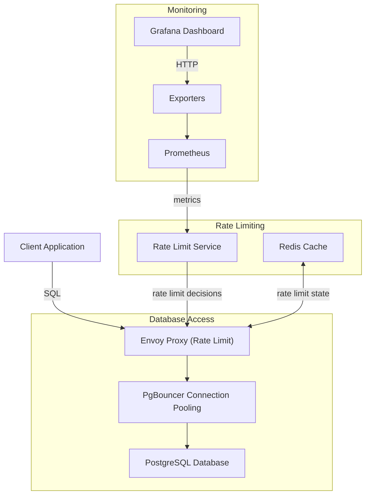

# PostgreSQL Rate Limiting with Envoy Proxy

## Project Overview

This project demonstrates how to protect a PostgreSQL database from unexpected high transaction rates and connection spikes using a combination of Envoy Proxy for rate limiting and PgBouncer for connection pooling. The system includes comprehensive monitoring with Prometheus and Grafana to visualize the effects of rate limiting and connection pooling.

The main components of this architecture are:

1. **Envoy Proxy**: Acts as the front door to the database, implementing rate limiting to control the number of transactions per second.
2. **PgBouncer**: Provides connection pooling to efficiently manage database connections.
3. **PostgreSQL**: The database server being protected.
4. **Rate Limit Service**: Works with Envoy to enforce rate limits.
5. **Monitoring Stack**: Prometheus and Grafana for metrics collection and visualization.
6. **Dummy Client**: Simulates client traffic with configurable transaction rates.

## Architecture Diagram



## How It Works

1. **Client Requests**: Applications connect to the PostgreSQL database through Envoy Proxy.
2. **Rate Limiting**: Envoy checks with the Rate Limit Service to determine if the request should be allowed based on configured limits.
3. **Connection Pooling**: If the request is allowed, it passes through PgBouncer, which efficiently manages database connections.
4. **Monitoring**: Prometheus collects metrics from all components, and Grafana visualizes them in dashboards.

## Benefits

- **Protection Against Traffic Spikes**: Limits the number of transactions per second to prevent database overload.
- **Efficient Connection Management**: PgBouncer reduces the number of actual connections to PostgreSQL.
- **Visibility**: Comprehensive monitoring shows the effects of rate limiting and connection pooling.
- **Scalability**: The architecture can be scaled to handle more traffic by adjusting rate limits and connection pool sizes.

## How to Run the Project

### Prerequisites

- Docker and Docker Compose
- Git

### Setup and Run

1. Clone the repository:
   ```bash
   git clone <repository-url>
   cd postgresql-rate-limiting
   ```

2. Start the services:
   ```bash
   docker-compose up -d
   ```

3. Access the monitoring dashboards:
   - Grafana: http://localhost:3001 (username: admin, password: admin)
   - Prometheus: http://localhost:9090

4. Test the rate limiting:
   ```bash
   # Increase the transaction rate in the dummy client
   docker-compose exec dummy-client sh -c "export TPS=20 && python client.py"
   ```

5. Observe the effects in Grafana:
   - The "Client vs Database Transaction Rate" panel shows the difference between attempted and successful transactions
   - The "PgBouncer Client Connections" and "PgBouncer Server Connections" panels show connection pooling in action

### Configuration

- **Rate Limits**: Edit `ratelimit/config.yaml` to adjust the rate limits
- **Connection Pooling**: Edit `pgbouncer/pgbouncer.ini` to adjust connection pool settings
- **Client Load**: Adjust the `TPS` environment variable in `docker-compose.yaml` for the dummy-client service

## Components

- **PostgreSQL**: Standard PostgreSQL database
- **PgBouncer**: Lightweight connection pooler for PostgreSQL
- **Envoy**: High-performance proxy with rate limiting capabilities
- **Rate Limit Service**: Implements the rate limiting logic
- **Redis**: Stores rate limit state
- **Prometheus**: Collects metrics from all components
- **Grafana**: Visualizes metrics in dashboards
- **Dummy Client**: Simulates client traffic with configurable transaction rates
- **Exporters**: Collect metrics from PostgreSQL and PgBouncer

## Monitoring

The Grafana dashboard includes panels for:

- Attempted Queries Rate
- Successful Queries Rate
- Failed Queries Rate
- Query Latency
- Client vs Database Transaction Rate
- PgBouncer Client Connections
- PgBouncer Server Connections
- Connection Pooling Efficiency

## Conclusion

This project demonstrates a practical approach to protecting PostgreSQL databases from unexpected traffic spikes using industry-standard tools. The combination of rate limiting and connection pooling provides robust protection while maintaining visibility through comprehensive monitoring.
