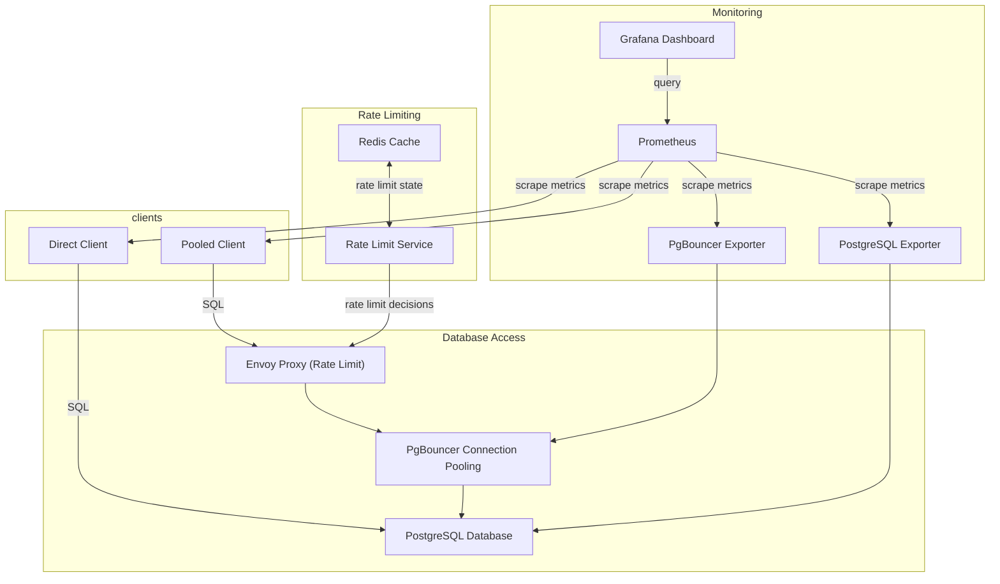
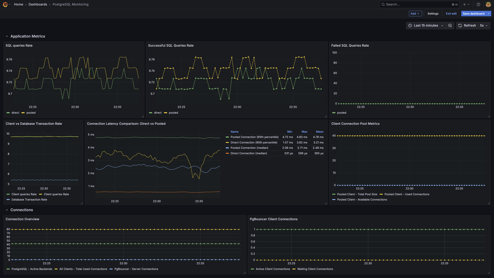

# PostgreSQL Rate Limiting with Envoy Proxy

## Project Overview

This project demonstrates how to protect a PostgreSQL database from unexpected high transaction rates and connection spikes using a combination of Envoy Proxy for rate limiting and PgBouncer for connection pooling. The system includes comprehensive monitoring with Prometheus and Grafana to visualize the effects of rate limiting and connection pooling.

The main components of this architecture are:

1. **Envoy Proxy**: Acts as the front door to the database, implementing rate limiting to control the number of transactions per second.
2. **PgBouncer**: Provides connection pooling to efficiently manage database connections.
3. **PostgreSQL**: The database server being protected.
4. **Rate Limit Service**: Works with Envoy to enforce rate limits.
5. **Monitoring Stack**: Prometheus and Grafana for metrics collection and visualization.
6. **Test Clients**: Two client applications that simulate different connection patterns:
   - **Pooled Client**: Connects through Envoy and PgBouncer
   - **Direct Client**: Connects directly to PostgreSQL

## Architecture Diagram



## How It Works

1. **Client Requests**: Two test clients demonstrate different connection patterns:
   - The **Pooled Client** connects through Envoy Proxy and PgBouncer, benefiting from rate limiting and connection pooling
   - The **Direct Client** connects directly to PostgreSQL, bypassing the protective layers
   
2. **Connection Pooling Comparison**: Both clients implement their own application-level connection pools (40 connections each), allowing comparison between:
   - Multi-layered pooling (application pool → Envoy → PgBouncer → PostgreSQL)
   - Direct pooling (application pool → PostgreSQL)

3. **Rate Limiting**: Envoy checks with the Rate Limit Service to determine if requests from the pooled client should be allowed based on configured limits.

4. **Monitoring**: Prometheus collects metrics from all components, and Grafana visualizes them in dashboards, showing the performance differences between the two connection patterns.

## Benefits

- **Protection Against Traffic Spikes**: Limits the number of transactions per second to prevent database overload.
- **Efficient Connection Management**: PgBouncer reduces the number of actual connections to PostgreSQL.
- **Visibility**: Comprehensive monitoring shows the effects of rate limiting and connection pooling.
- **Comparison**: Direct visualization of the performance differences between protected and unprotected database access.
- **Scalability**: The architecture can be scaled to handle more traffic by adjusting rate limits and connection pool sizes.

## How to Run the Project

### Prerequisites

- Docker and Docker Compose
- Git

### Setup and Run

1. Clone the repository:
   ```bash
   git clone <repository-url>
   cd postgresql-rate-limiting
   ```

2. Start the services:
   ```bash
   docker-compose up -d
   ```

3. Access the monitoring dashboards:
   - Grafana: http://localhost:3001 (username: admin, password: admin)
   - Prometheus: http://localhost:9090


5. Observe the effects in Grafana:
   - The "Connection Latency Comparison" panel shows the performance difference between pooled and direct connections
   - The "Connection Overview" panel shows how connections are managed at different layers

### Configuration

- **Rate Limits**: Edit `ratelimit/config.yaml` to adjust the rate limits
- **Connection Pooling**: Edit `pgbouncer/pgbouncer.ini` to adjust connection pool settings
- **Client Load**: Adjust the `TPS` environment variable in `docker-compose.yaml` for both client services
- **Connection Pool Size**: Adjust the `POOL_MIN_SIZE` and `POOL_MAX_SIZE` environment variables to change the application-level connection pool sizes

## Client Applications

### Pooled Client

The pooled client connects to PostgreSQL through Envoy Proxy and PgBouncer, demonstrating a protected database access pattern:

- Uses a connection pool of 40 connections at the application level
- Requests are rate-limited by Envoy Proxy (50 requests per second)
- Connections are pooled again by PgBouncer, reducing the actual connections to PostgreSQL
- Metrics show the effects of multi-layered connection pooling and rate limiting

### Direct Client

The direct client connects directly to PostgreSQL, bypassing the protective layers:

- Uses the same connection pool size (40 connections) at the application level
- No rate limiting is applied
- No intermediate connection pooling
- Provides a baseline for comparison with the pooled client

## Monitoring

The Grafana dashboard includes panels for:

- Attempted Queries Rate (by client)
- Successful Queries Rate (by client)
- Failed Queries Rate (by client)
- Query Latency Comparison (pooled vs direct)
- Connection Pool Metrics (by client)
- PgBouncer Client and Server Connections
- Connection Overview (showing all layers)




## Conclusion

This project demonstrates a practical approach to protecting PostgreSQL databases from unexpected traffic spikes using industry-standard tools. The comparison between the pooled and direct clients clearly shows the benefits of implementing rate limiting and connection pooling in terms of:

1. **Controlled Resource Usage**: The pooled client's traffic is regulated, preventing database overload
2. **Connection Efficiency**: PgBouncer reduces the actual connections to PostgreSQL
3. **Performance Characteristics**: The dashboard shows the latency differences between the two approaches

These insights can help database administrators and developers make informed decisions about implementing similar protections in production environments.


## Note

This README and most of the code and configuration has been generated by claude-3.7-sonnet. I didn't rechecked for typos, useless configuratio and all.

Credit: @jbourdale - jules.bourdale@gmail.com
